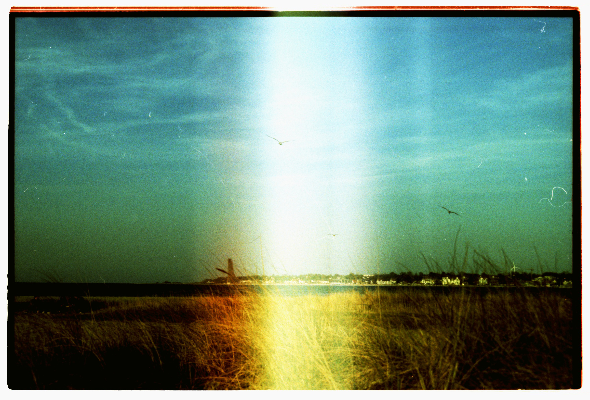

    

# Moin, I'm Antje

Seriously, I want to be a web developer.   
Doing the work.

- **Learning:** Web Development with neue fische and The Odin Project.
- **Languages:** JavaScript
- **Experienced:** IT Project Manager, HR Manager

             

I started off my journey with The Odin Project. It's a great, great online open source course to get started with web development. The neue fische bootcamp that I'm currently accomplishing is giving me the final touch to be ready to actually work as a web developer. I'm so excited to see what's coming next!

Meanwhile, I also like hiking as you can see from my profile picture. Any recommendations for hiking trails? Get in touch!